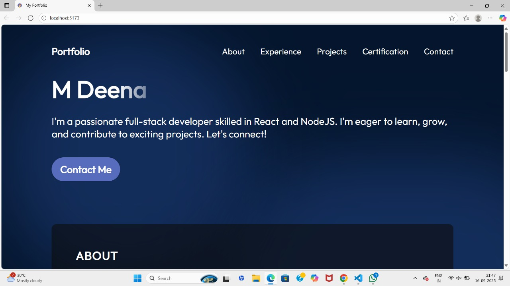
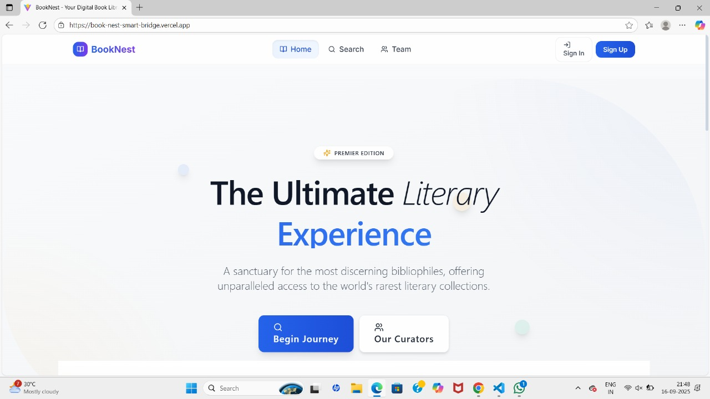
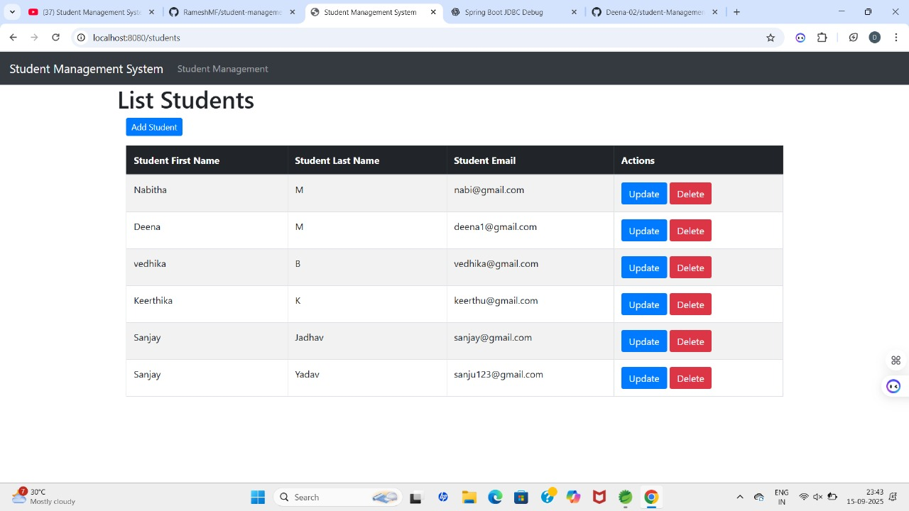

# 🌐 Portfolio Website

A modern, responsive **developer portfolio** built with **React + Vite** to showcase my projects, skills, and experience.

---

## 🚀 Live Demo
🔗 [View Portfolio](#) *(Update this once you deploy)*

---

## 🛠️ Tech Stack
- **Frontend:** React, Vite  
- **Styling:** CSS Modules  
- **Version Control:** Git & GitHub  

---

## ✨ Features
✅ Responsive design (mobile, tablet, desktop)  
✅ Projects section with details and images  
✅ About & Experience sections  
✅ Certificates section  
✅ Contact links to email, GitHub & LinkedIn  
✅ Smooth navigation with a clean UI  

---

## 📸 Screenshots
### Homepage  

### Projects  

---

## 📬 Contact
👤 **M Deena**  
🔗 [LinkedIn](https://www.linkedin.com/in/m-deena-1048032b6)  
💻 [GitHub](https://github.com/Deena-02)  
📧 mailto:deena1202m@gmail.com
